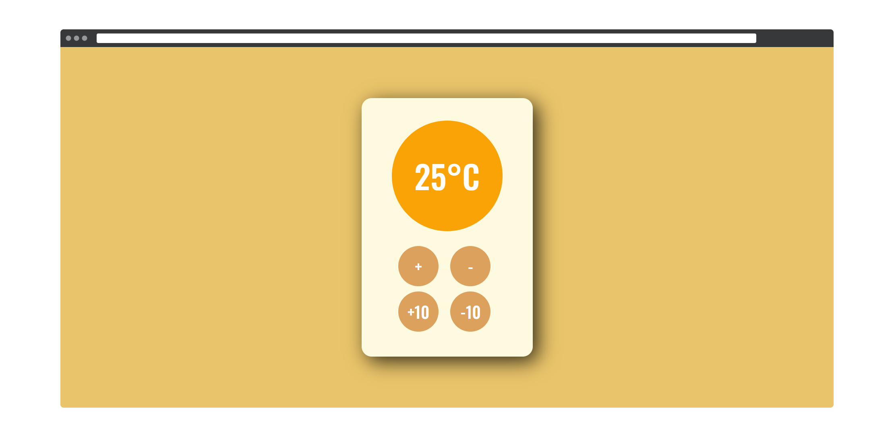

  
  

## Features
- color of the meter changes based on the temperature
- on reaching the max or min temperature app shows a toast
- buttons get disabled when max/min temperature reached
- it's a PWA!
